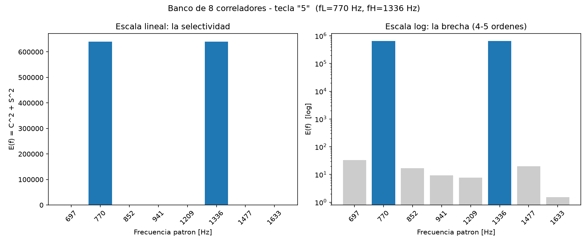
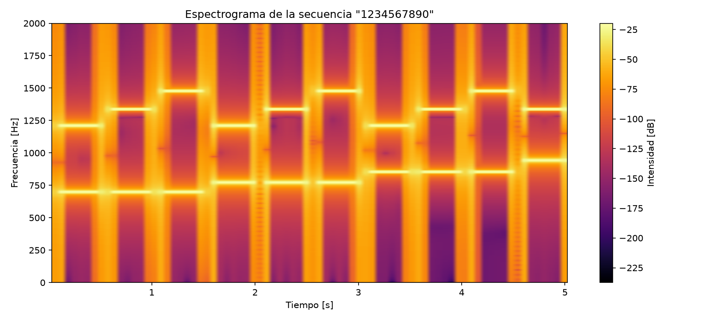

# Sistema DTMF — Generación y decodificación de tonos telefónicos


**Proyecto Final Integrador — Señales y Sistemas · UADE · 2026, 1er cuatrimestre**

Cada vez que se presiona una tecla en un teléfono de tonos, el aparato no envía un código digital: emite un **sonido** formado por la suma de exactamente dos senoidales puras (estándar **DTMF**, *Dual-Tone Multi-Frequency*, Bell Labs, 1963). En este proyecto programamos las dos puntas del sistema:

- un **generador** que sintetiza el audio real de una marcación y lo exporta a `.wav`, y
- un **decodificador** que escucha ese audio (sintético *o grabado por micrófono*) y recupera el número marcado usando **correlación en cuadratura** — que, como se demuestra en el informe, es exactamente evaluar la **DFT** en 8 frecuencias puntuales.

El proyecto integra los temas de toda la cursada: señales conocidas y transformaciones, muestreo y Nyquist, sistemas lineales, convolución, correlación y análisis de Fourier (DFT/FFT).

---

## La idea en dos ecuaciones

Cada tecla del teclado 4×4 suma la senoidal de su fila (grupo bajo) y la de su columna (grupo alto):

$$x_k(m) = A\left[\mathrm{sen}\left(\tfrac{2\pi f_L m}{f_s}\right) + \mathrm{sen}\left(\tfrac{2\pi f_H m}{f_s}\right)\right]$$

|            | **1209 Hz** | **1336 Hz** | **1477 Hz** | **1633 Hz** |
| ---------- | :---------: | :---------: | :---------: | :---------: |
| **697 Hz** |      1      |      2      |      3      |      A      |
| **770 Hz** |      4      |      5      |      6      |      B      |
| **852 Hz** |      7      |      8      |      9      |      C      |
| **941 Hz** |      *      |      0      |      #      |      D      |

Para detectar qué frecuencias contiene un tramo de audio, se lo correlaciona contra patrones seno y coseno de cada frecuencia candidata y se combinan ambos resultados (la identidad pitagórica elimina la fase desconocida del tono):

$$E(f) = \left[\sum_m x(m)\cos\tfrac{2\pi f m}{f_s}\right]^2 + \left[\sum_m x(m)\mathrm{sen}\tfrac{2\pi f m}{f_s}\right]^2$$

De los 8 correladores solo se "encienden" dos — la fila y la columna de la tecla presionada:

<p align="center">
  
</p>

## Resultados principales

| Experimento | Resultado |
| --- | --- |
| Contraste analítico vs. medido | Predicción $E=(A\cdot N/2)^2 = 640\,000$; error medido **< 0,25 %** |
| Selectividad del banco de correladores | Frecuencias ausentes **4–5 órdenes de magnitud** por debajo del pico |
| Verificación cruzada correlación vs. FFT | Coincidencia en el **100 %** de las teclas |
| Robustez frente a ruido blanco (Monte Carlo) | **100 % de acierto hasta SNR = −18 dB** (ruido 63× la señal) |
| Captura real por micrófono (44,1 kHz → 8 kHz) | Secuencia `1#*A` decodificada completa en ambiente silencioso |

<p align="center">
  
</p>

## Estructura del repositorio

```
proyecto_dtmf/
├── codigo/                          # scripts de Python (ver README propio con la guía de ejecución)
│   ├── dtmf_comun.py                #   constantes, tabla 4×4 y correlador en cuadratura
│   ├── generador.py                 #   síntesis de la secuencia → marcacion.wav
│   ├── decodificador.py             #   segmentación + banco de 8 correladores (+ verificación FFT)
│   ├── robustez_ruido.py            #   curva de acierto vs. SNR (Monte Carlo)
│   ├── captura_microfono.py         #   prueba con tonos reales: graba, resamplea a 8 kHz y decodifica
│   ├── espectrogramas_captura.py    #   espectrogramas comparativos limpio vs. ruido
│   ├── analisis_validacion.py       #   figuras de validación + contraste teoría vs. medición
│   └── requirements.txt             #   numpy, scipy, matplotlib
└── evidencias/                      # capturas y .wav de cada corrida documentada en el informe
    ├── test-default/                #   secuencia completa de 16 teclas
    ├── test-frecuencias/            #   secuencia "159" (6 frecuencias distintas)
    ├── test-repetibilidad/          #   secuencia "555" (determinismo del sistema)
    ├── test-mic-limpio/             #   captura real por micrófono, ambiente silencioso
    └── test-mic-ruido/              #   la misma secuencia con ruido ambiente
```

## Cómo correrlo

```bash
cd codigo
python -m venv venv && venv\Scripts\activate    # (Windows)
pip install -r requirements.txt
python generador.py          # genera marcacion.wav + gráficas
python decodificador.py      # recupera el número desde el .wav
python robustez_ruido.py     # curva de acierto vs. SNR
```

La guía completa (incluida la captura por micrófono, que requiere `pip install sounddevice`) está en [`codigo/README.md`](codigo/README.md).

> El archivo `marcacion.wav` se puede reproducir con cualquier reproductor: suena exactamente igual que un teléfono real.

## Integrantes

| Apellido y nombre |
| --- |
| Alegre, Marcos |
| Bolanca, Santiago |
| Castiglioni, Jorge |
| Guzmán, Pablo |
| Mariani, Máximo |

**Materia:** Señales y Sistemas — Ingeniería Electrónica, UADE
**Docente:** Ing. Fernando Ramiro Abad
**Fecha:** Julio de 2026
